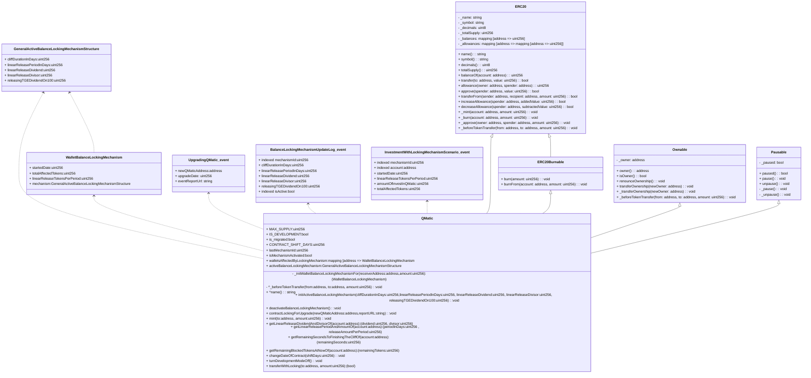

# 
[](https://choosealicense.com/licenses/mit/)
[]()
# QMatic

$QMATIC is an [ERC-20](https://eips.ethereum.org/EIPS/eip-20) token that will be used as the main currency in all of the QPoker services. <br/>
-   **Deployed at**: [0xa9A2a92970C2430B88df6cABB01Dc40bE6aB710E](https://polygonscan.com/address/0xa9a2a92970c2430b88df6cabb01dc40be6ab710e)<br/>
-   **Deployment transaction hash**: [0xb47...0443](https://polygonscan.com/tx/0xb4717bc7f618e5115843835d3ac98580386f7834f108eb35079c51a0b9d00443)<br/>
-   **Deployer wallet address**: [0x76de186cc58f75Bb425E6072C8E3AaFC3948080D](https://polygonscan.com/address/0x76de186cc58f75bb425e6072c8e3aafc3948080d)


## Project Description

QPoker is a decentralized iGaming venture that leverages the power of blockchain technology and decentralized finance to form the first truly cosmopolitan iGaming experience without geographical restrictions. The QPoker platform uses the [ERC-20](https://eips.ethereum.org/EIPS/eip-20) token called $QMATIC that is built on the [Polygon blockchain](https://polygon.technology/). With QMatic the players can compete against one another on skill-based games like QPoker and QBetting, trade and speculate on the exchanges, and purchase NFTs from our incoming marketplace. The QMatic is based on Solidity, a programming language that is commonly used for writing smart contracts on the Polygon blockchain. QMatic's smart contract code is open-source and available in the [official QMatic repository](https://github.com/QPoker/QMatic). The QPoker project also uses Python with the Brownie framework, a development environment for building, testing, and deploying smart contracts on the Polygon Mainnet.
In addition, we use two important tools for analyzing and improving the security for our smart contracts:
-   **[Slither](https://github.com/crytic/slither):** A static analysis tool that helps to detect security vulnerabilities and potential bugs in the Solidity code.
    
-   **[Solhint](https://github.com/protofire/solhint):** A linter for Solidity code that checks for common mistakes and enforces the best practices.

The players can connect to QPoker platform by using any of their Web3 wallet (e.g. [MetaMask](https://metamask.io/)) and start playing right away. The QPoker players can also earn rewards by referring new users in the game platform or just by staying active in the social media. All of the users activities will get tracked on real time by our high-tech managament tools (e.g. [QPoker Airdrop](https://airdrop.qpoker.io/login)).
All the QPoker services are designed to be upstanding and transparent with minimal gas fees. Naturally, all the transactions will be recorded on the blockchain.

We strongly believe that decentralized GameFi will lead the future for iGaming, and QPoker will play significant role in this transformation. Decentralized finance will provide a new paradigm for global iGaming that is more engaging, righteous, and cost-efficient for players all over the world.
## Folder structure
```
├── QMatic                # QMatic project.
│   ├── adapters          # contains the adapters.
│   ├── contracts         # contains contract `.sol` files.
│   ├── schemas           # contains QMatic schemas such as structs, events,etc. 
│   ├── scripts           # contains the deploy scripts.
│   ├── tests             # contains all the utilities and test functions.
```
## QMatic Distribution
As opened up on the [whitepaper](https://qpoker.io/whitepaper) QMatic has a twofold locking mechanism for all of the token distribution phases before the public exchange listing: Airdrop, Private Sale & Pre-sale. These two functions are familiarized under names: Cliff & Vesting Schedule.
-   **Cliff** means that after transferring the token into the wallet, the user cannot transfer predefined part of the locked tokens till the end of the cliff period. Every cliff has a specified starting and ending time.
-   **Vesting schedule** means that after the cliff period, the blocked tokens will be released through a period of time and the releasing will take place linearly.<br/>


Hereby, the locking mechanism consists of three different combinations of locking:
 1. Only Cliff
 2. Only Vesting Schedule
 3. Cliff + Vesting Schedule.<br/>
 In the 2nd option, “Only Vesting Schedule”, the mechanism will be put into effect immediately after transferring the predetermined tokens.<br/>
Note: The abovementioned locking mechanisms can be accompanied with TGE release which means that a predefined share (%) of the tokens will release immediately after the transfer and the locking mechanisms will have no impact on that TGE proportion.<br/>

 
## QMatic Architecture



Made with [Mermaid](https://mermaid.live/).
## Getting Started

To get started with the $QMatic token, you will need to have:
 - python 3.9.12
 - poetry
 - yarn<br/>

You can find the code for $QMatic in this repository. We recommend using the Brownie framework to test the smart contract code.


#### Installing dependencies and creating a shell
```shell
$ poetry install
$ poetry shell
```
#### Running tests
```shell
$ brownie test
```
this command will compile all the solidity codes for the first time but if you want to compile solidity code you could enter `brownie compile`.
#### Test coverage
```shell
$ brownie test -C
```
for checking the project by slither and solhint needs to install dependencies first by:
#### Installing dependencies
```shell
$ yarn install
```
#### Slither
```shell
$ yarn run slither
```
#### Lint
```shell
# To check lint errors
$ yarn run lint

# To fix most common lint errors
# Note that it might not fix all errors, some need manual intervention
$ yarn run lint:fix
```
## Contact Us
Should you have any technical questions or want to share feedback about our project, feel free to email: m.r.mousavi@qpoker.io Or m.r.mousavi.n@gmail.com. We would love to hear from you!

## License
QPoker Contracts are released under the [MIT License](./LICENSE).